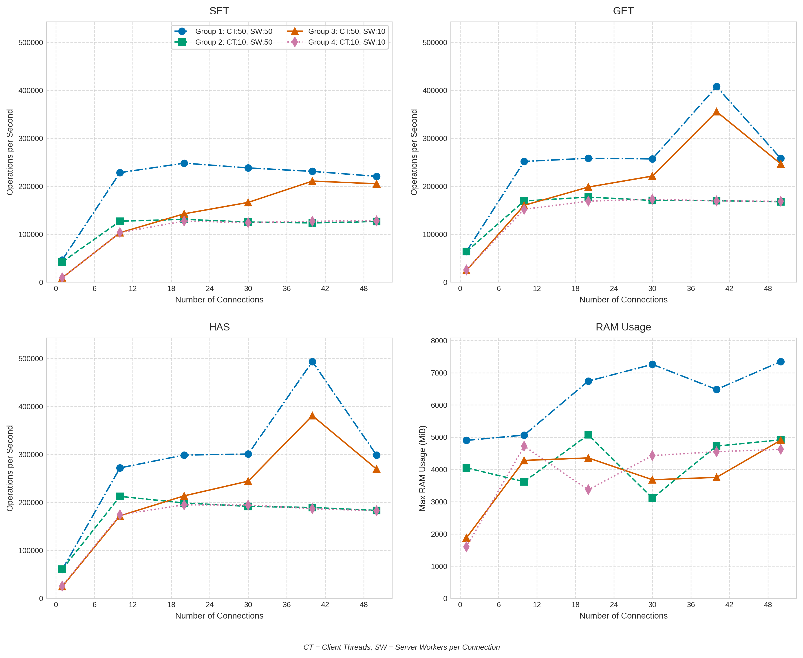

**dKV** is a distributed, consistent key-value store library written in Go, leveraging RAFT consensus for
linearizability and fault tolerance. Features include high performance, strong consistency, flexible deployment,
time-based operations, distributed locking, and modular architecture.

[](https://goreportcard.com/report/github.com/ValentinKolb/dKV)
[](https://pkg.go.dev/github.com/ValentinKolb/dKV)
[](LICENSE)
[](https://github.com/ValentinKolb/dKV/actions/workflows/docker.yml)
[](https://github.com/ValentinKolb/dKV/actions/release/docker.yml)
[](https://github.com/ValentinKolb/dKV/releases)

---

. **[Quick Start](#quick-start)** . **[Configuration](#configuration)** . **[Benchmarks](#benchmarks)** .
**[Architecture Overview](#architecture-overview)** . **[Detailed Usage](#detailed-usage)** .
**[License](#license)** .

---

:warning: This project is in early development and not yet production-ready. Use at your own risk.

## Quick Start

### Client

The recommended way to install the dKV client is using the installation script:

```bash
curl -s https://raw.githubusercontent.com/ValentinKolb/dKV/refs/heads/main/install.sh | bash
```

The script automatically detects your operating system and architecture, and installs the appropriate binary.

<details>
<summary>Installation Options</summary>

```bash
# Install to a custom location
curl -s https://raw.githubusercontent.com/ValentinKolb/dKV/refs/heads/main/install.sh | bash -s -- --path=/your/custom/path

# Install from source instead of using pre-compiled binaries
curl -s https://raw.githubusercontent.com/ValentinKolb/dKV/refs/heads/main/install.sh | bash -s -- --source

# Show help and all available options
curl -s https://raw.githubusercontent.com/ValentinKolb/dKV/refs/heads/main/install.sh | bash -s -- --help
```
</details>

### Usage

Once installed, you can use dKV (requires a server running):

```bash
dkv kv set --shard=100 foo bar
dkv kv get --shard=100 foo
```

#### Server

It is recommended to use docker to deploy the server. The following command starts a local single node server:

```bash
export DKV_TIMEOUT=10 # Set config values for the server as env vars 

docker run -p 8080:8080 ghcr.io/valentinkolb/dkv:latest --transport-workers=100 # <- set dkv config flags here
```

Multiple example docker compose files are provided:

- [Single Node](https://github.com/ValentinKolb/dKV/blob/main/examples/compose-single-node.yml)
- [Cluster](https://github.com/ValentinKolb/dKV/blob/main/examples/compose-multi-node.yml)

Alternatively you can use the CLI to start a server:

```bash
dkv serve --timeout="10" --transport-workers=100
```

## Configuration

To see all available configuration options for the server, run:

```bash
dkv serve --help

# Also:
dkv kv --help # for kv operations
dkv lock --help # for lock operations
```

All command line flags can be set via environment variables by prefixing them with `DKV_`:

```env
# --timeout=5 will become:
DKV_TIMEOUT=5

# --log-level=debug will become:
DKV_LOG_LEVEL=debug
```

## Benchmarks



For in detail benchmarks and comparisons see [here](https://github.com/ValentinKolb/dKV/tree/main/benchmarks).

## Architecture Overview

dKV follows a nested architecture with clean interfaces between components:

```
+--------------------------------------------------+         +-----------------+ 
|  RPC Shell                                       |   ←-→   | CLI Client      |
|                                                  |         +-----------------+
|  +--------------------------------------------+  |
|  |  Lock Manager (optional)                   |  |         +-----------------+ 
|  |                                            |  |   ←-→   | Golang Client   |
|  |  +--------------------------------------+  |  |         +-----------------+ 
|  |  |  Consistency Component (RAFT)        |  |  |          
|  |  |                                      |  |  |          ↑  Load Balancing
|  |  |  +--------------------------------+  |  |  |          ↓  & High Avail.
|  |  |  |  Data Core (Maple)             |  |  |  |          
|  |  |  |                                |  |  |  |         +-----------------+
|  |  |  +--------------------------------+  |  |  |   ←-→   | Other dkv Nodes |
|  |  +--------------------------------------+  |  |         #       ↑ ↓       # 
|  +--------------------------------------------+  |   ←-→   | Other dkv Nodes |
+--------------------------------------------------+         +-----------------+ 
```

### Consistency Guarantees

dKV provides linearizable consistency for distributed operations. Operations execute atomically in a total order that
respects logical time. With the distributed store (`dstore`), all operations reflect the most recently committed state
across the cluster. A write on any node is visible to subsequent reads from any node. RAFT consensus ensures data
integrity even with node failures (up to N failures in a 2N+1 node cluster).
Local stores (`lstore`) offer the same guarantees but only on a single node.

The lock manager provides distributed mutual exclusion when using a distributed store. Locks prevent concurrent access
to the same resource across the cluster, with ownership verification ensuring only the lock holder can release it.

### Data Core (`db`)
At the center of dKV is a high-performance key-value database implementing the `KVDB` interface. 
The Maple reference implementation provides optimized storage with multi-level sharding, lock-free data structures, and efficient garbage collection.

### Consistency Component (`store`)
Encapsulating the data core, the consistency component provides linearizable operations through the `IStore` interface with two implementations:
- `dstore`: Distributed store using RAFT consensus
- `lstore`: Local store with high performance, not replicated

### Lock Manager (`lockmgr`)
An optional wrapper component providing distributed mutex functionality using the `ILockManager` interface, built on top of any `IStore` implementation.

### RPC Shell
The outermost component enables remote communication with interchangeable transports, serialization formats, and adapters:

```
+--------------------------------+
|           Client               |   Go Client / Cli
+--------------------------------+
|               ↑                |
|   +------------------------+   |
|   | IStore / ILockManager  |   |
|   +------------------------+   | 
|   | (De-) Serialization    |   |   RPC Client
|   +------------------------+   |
|   | Client Transport       |   |
|   +------------------------+   |
|              ↑ ↓               |   Network
|   +------------------------+   |
|   | Server Transport       |   |
|   +------------------------+   |
|   | (De-) Serialization    |   |   RPC Server
|   +------------------------+   |
|   | Server Adapters        |   |
|   +------------------------+   |
|               ↓                |
+--------------------------------+
|     IStore / ILockManager      |   RAFT Cluster
+--------------------------------+
```

## Detailed Usage

### RPC Server

The server supports both local and distributed instances at the same time, allowing flexible deployment configurations. Here's how to set up a three-node cluster:

```bash
docker compose -f examples/compose-multi-node.yml up
```

This creates a cluster with three nodes (if called three time for different ID's), each running:
- Shard `100`: Local store (not replicated)
- Shard `200`: Distributed store (replicated across all nodes)
- Shard `300`: Distributed lock manager (using the distributed store)

<details>
<summary>Start server via cli</summary>

```bash
# Start a three-node cluster (run for IDs 1, 2, and 3)
ID=1 # Change this for each node
dkv serve \
  --shards="100:lstore,200:dstore,300:lockmgr(dstore)" \
  --replica-id "node-${ID}" \
  --cluster-members="node-1=localhost:63001,node-2=localhost:63002,node-3=localhost:63003" \
  --data-dir="/tmp/data/node-${ID}" \
  --serializer="binary" \
  --transport="tcp" \
  --transport-endpoint ":808${ID}" \
  --transport-workers=100 \
  --transport-tcp-nodelay \
  --transport-tcp-keepalive=1 \
  --transport-tcp-linger=10 \
  --log-level="info" \
  --timeout=5
```

</details>

### Client Operations

#### Local Key-Value Operations

Local operations are limited to the node they're performed on:

```bash
# Set value in local store on one node
dkv kv set --shard=100 --endpoints="localhost:8081" foo bar

# Reading from same node succeeds
dkv kv has --shard=100 --endpoints="localhost:8081" foo  # Result: found=true

# Reading from different node fails (local store is not replicated)
dkv kv has --shard=100 --endpoints="localhost:8082" foo  # Result: found=false
```

#### Distributed Key-Value Operations

Distributed operations leverage RAFT consensus to provide linearizable consistency across the entire cluster. When a write succeeds on any node, it's guaranteed that all subsequent reads from any node will immediately reflect this change - even if reading from a different node than where the write occurred:

```bash
# Set value in distributed store
dkv kv set --shard=200 --transport-endpoints="localhost:8081" foo bar

# Load balancing across multiple nodes
dkv kv set --shard=200 --transport-endpoints="localhost:8081,localhost:8082,localhost:8083" foo bar

# Reading from any node returns the same data (replicated store)
dkv kv get --shard=200 --transport-endpoints="localhost:8082" foo  # Result: found=true
```

The local and distributed store supports all operations defined in the `IStore` interface:

- `Set(key, value)`: Store a value with a key
- `SetE(key, value, expireIn, deleteIn)`: Store with optional expiration and deletion times
- `SetEIfUnset(key, value, expireIn, deleteIn)`: Atomic compare-and-swap operation
- `Expire(key)`: Mark a key's value as expired (still visible with Has())
- `Delete(key)`: Completely remove a key-value pair
- `Get(key)`: Retrieve a value by key (not expired)
- `Has(key)`: Check if a key exists (even if value is expired)
- `GetDBInfo()`: Retrieve metadata about the database (not available via RPC - jet)

These operations can be performed either via the CLI or programmatically both remote via RPC and locally.

#### Lock Operations

The lock manager provides powerful distributed mutual exclusion capabilities when combined with a distributed store backend.
When using `lockmgr(dstore)`, the lock guarantees are automatically extended across the entire cluster,
ensuring that if a process on any node acquires a lock, no other process anywhere in the cluster can acquire the same lock simultaneously.
This cluster-wide protection is built on the RAFT consensus protocol's linearizability consistency guarantees:

```bash
# Acquire a distributed lock (will be exclusively held across the entire cluster)
dkv lock acquire --shard=300 --transport-endpoints="localhost:8081" foo  # Result: acquired=true, ownerId=ID_VALUE

# Release the lock (making it available to any other process in the cluster)
dkv lock release --shard=300 --transport-endpoints="localhost:8081" foo ID_VALUE  # Result: released=true
```

#### Performance Testing

dKV includes built-in benchmarking capabilities to evaluate performance:

```bash
# Run performance benchmarks
dkv kv perf --threads=10 --skip="mixed" --large-value-size=128 --keys=500 --csv="./benchmark.csv"
```

### Programmatic Usage

You can integrate dKV directly into your Go applications. First, install the library:

```bash
go get github.com/ValentinKolb/dKV
```

#### Using Local Store and Lock Manager

For single-node applications, the local store provides optimal performance:

```go
package main

import (
    "log"
    "github.com/ValentinKolb/dKV/lib/store/lstore"
    "github.com/ValentinKolb/dKV/lib/db/engines/maple"
    "github.com/ValentinKolb/dKV/lib/lockmgr"
    "github.com/ValentinKolb/dKV/lib/db"
)

func main() {
    // Create a database factory function
    dbFactory := func() db.KVDB { return maple.NewMapleDB(nil) }
    
    // Create a local store
    store := lstore.NewLocalStore(dbFactory)
    
    // Perform key-value operations
    _ = store.Set("keys/foo", []byte("bar"))
    value, exists, _ := store.Get("keys/foo")
    
    // Create a lock manager using the store
    lockMgr := lockmgr.NewLockManager(store)
    
    // Perform locking operations
    acquired, ownerId, _ := lockMgr.AcquireLock("locks/foo", 30)
    if acquired {
        // Use the resource safely
        lockMgr.ReleaseLock("locks/foo", ownerId)
    }
}
```

While it's possible to create a distributed store directly with the dKV library in Go, this approach requires in-depth
knowledge of the Dragonboat RAFT library and isn't generally recommended.
A reference implementation of a RAFT cluster is available in the RPC server code for those interested in the details.
For most use cases, simply using the RPC server is the recommended approach for distributed storage capabilities.

#### Creating an RPC Client

Client applications can communicate with dKV servers using the RPC shell:

```go
package main

import (
	"log"
	"github.com/ValentinKolb/dKV/rpc/common"
	"github.com/ValentinKolb/dKV/rpc/serializer"
	"github.com/ValentinKolb/dKV/rpc/transport/tcp"
	"github.com/ValentinKolb/dKV/rpc/client"
)

func main() {
	// Create client configuration
	config :=  common.ClientConfig{
		TimeoutSecond: viper.GetInt("timeout"),
		Transport: common.ClientTransportConfig{
			RetryCount:             2,
			Endpoints:              []string{"localhost:8080"},
			SocketConf: common.SocketConf{
				WriteBufferSize: 512 * 1024,
				ReadBufferSize:  5125 * 1024,
				// ...
			},
			TCPConf: common.TCPConf{
				TCPNoDelay:      true,
				// ...
			},
		},
	}

	// Create serializer and transport
	t := tcp.NewTCPClientTransport()
	s := serializer.NewBinarySerializer()

	// Create store client
	rpcStore, _ := client.NewRPCStore(100, config, t, s)

	// Perform key-value operations
	_ = rpcStore.Set("foo", []byte("bar"))
	value, exists, _ := rpcStore.Get("foo")

	// Create lock manager client
	rpcLock, _ := client.NewRPCLockMgr(200, config, t, s)

	// Perform locking operations
	acquired, ownerId, _ := rpcLock.AcquireLock("foo", 30)
	if acquired {
		// Use the resource safely
		rpcLock.ReleaseLock("foo", ownerId)
	}
}
```

#### Creating an RPC Server

Custom configurations can be created for server applications:

```go
package main

import (
    "log"
    "github.com/ValentinKolb/dKV/rpc/common"
    "github.com/ValentinKolb/dKV/rpc/serializer"
    "github.com/ValentinKolb/dKV/rpc/transport/tcp"
    "github.com/ValentinKolb/dKV/rpc/server"
)

func main() {
    // Create server configuration
    config := common.ServerConfig{
		TimeoutSecond: 5,
		LogLevel: "info",
        Shards: []common.ServerShard{
            {ShardID: 100, Type: common.ShardTypeLocalIStore},
            {ShardID: 200, Type: common.ShardTypeLocalILockManager},
        },
		Transport: common.ServerTransportConfig{
			TCPConf: common.TCPConf{
				// ...
			},
			SocketConf: common.SocketConf{
				// ...
			},
			WorkersPerConn: 100,
			Endpoint:       ":8080",
		},
    }
    
    // Create and start the server
    s := server.NewRPCServer(
        config,
        tcp.NewTCPServerTransport(1024 * 1024), // 1 MB buffer size
        serializer.NewBinarySerializer(),
    )
    
    // Start the server
    if err := s.Serve(); err != nil {
        log.Fatalf("Server error: %v", err)
    }
}
```

## License

Distributed under the MIT License. See `LICENSE` for details.

## Acknowledgments

- This library is part of my Bachelor Thesis at the University of Ulm.
- [Dragonboat](https://github.com/lni/dragonboat): RAFT consensus implementation.
- [xsync](https://github.com/puzpuzpuz/xsync): High-performance concurrent data structures for Go.
- The dKV logo uses the original Gopher design created by [Renee French](https://github.com/keygx/Go-gopher-Vector)