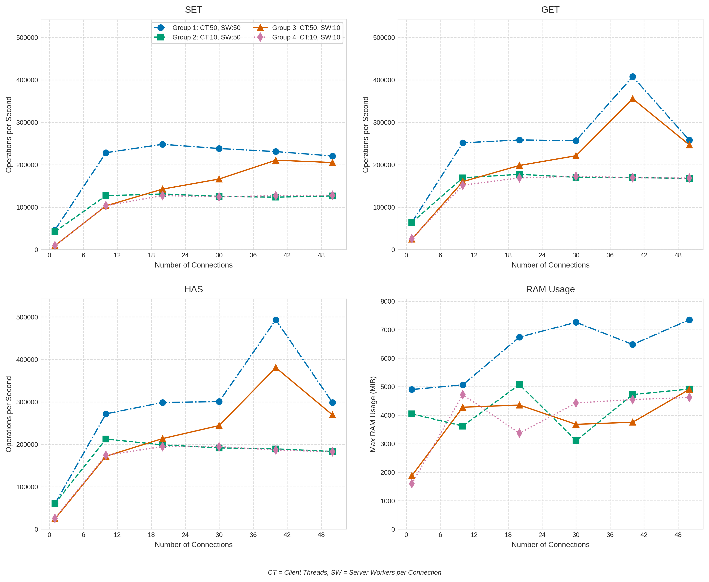
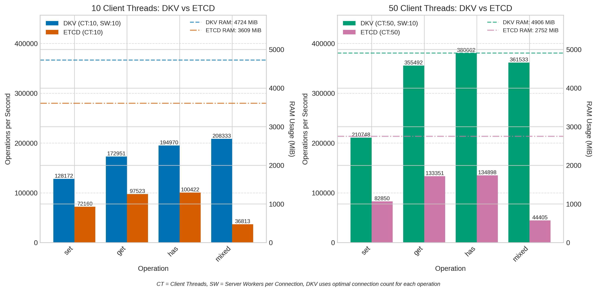
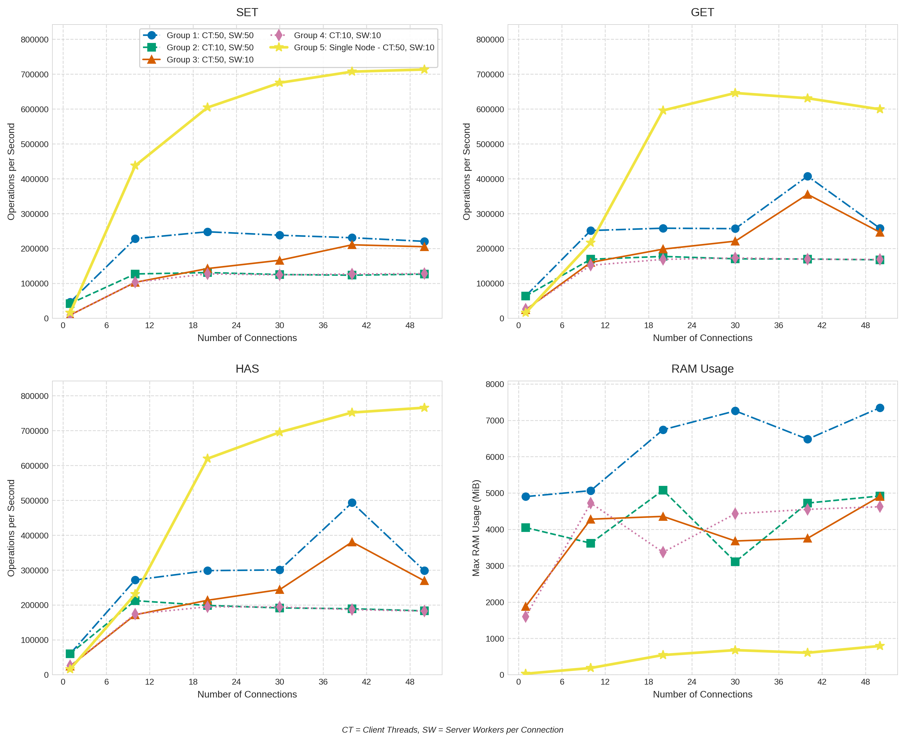

# dKV Benchmarks

For all benchmarks, the build in benchmarking tool was used:

```bash
dkv kv perf --flags
```

## Overview

For the benchmarks single node as well as cluster performance was evaluated.
As serialization format `binary` was used. For serialization benchmarks see below.

For single nodes all transport protocols were evaluated.
For cluster only TCP transport and binary serialization were evaluated since these are the ones
recommended for deployments.

The dkv server was run with docker and the client directly on the host via the cli.

### Server Specifications

All benchmarks were run on a single server. The server specifications are as follows:

- **CPU**: Intel(R) Xeon(R) Gold 5412U
    - 24 cores / 48 threads
    - 46080 KB cache
- **RAM**: 128 GB
- **Storage**:Samsung MZ1L2960 NVMe SSDs
    - Write speed: 910 MB/s (no direct IO, with cache)
    - Read speed: 2.2 GB/s
    - see [disk benchmark](./disk_bench.sh)
- **Operating System**: Ubuntu 24.04.2 LTS (Noble Numbat)
- **Kernel**: Linux
- **Virtualization**: Docker Engine - Community (version 27.4.1)
    - containerd: version 1.7.24
    - runc: version 1.2.2

## Cluster Benchmarks

The used client and server configuration can be viewed in this [docker compose](./bench/cluster-bench.yml) file.
To report the memory of running containers, this [script](./report_container_mem.sh) was used.

```bash
# Run benchmark
docker compose -f cluster-bench.yml up --abort-on-container-exit --remove-orphans --force-recreate
```



### Test group 1: Client Threads 50, Server Workers per Connection 50

| Connections | set (ops/sec) | large-set (ops/sec) | get (ops/sec) | delete (ops/sec) | has (ops/sec) | has-not (ops/sec) | mixed (ops/sec) | Combined Max RAM (MiB) |
|-------------|---------------|---------------------|---------------|------------------|---------------|-------------------|-----------------|------------------------|
| 1 conn      | 46438         | 342                 | 64123         | 44721            | 60165         | 71174             | 42447           | 4901,89                |
| 10 conn     | 228363        | 777                 | 251699        | 219250           | 271813        | 258465            | 226347          | 5065,73                |
| 20 conn     | 248139        | 714                 | 258331        | 234632           | 298597        | 277932            | 240964          | 6740,99                |
| 30 conn     | 238209        | 635                 | 257003        | 240096           | 300661        | 492854            | 402739          | 7259,14                |
| 40 conn     | 231000        | 547                 | 407498        | 346380           | 493340        | 522193            | 417188          | 6480,90                |
| 50 conn     | 220653        | 603                 | 258131        | 196002           | 298507        | 480769            | 420168          | 7347,21                |

### Test group 2: Client Threads 10, Server Workers per Connection 50

| Connections | set (ops/sec) | large-set (ops/sec) | get (ops/sec) | delete (ops/sec) | has (ops/sec) | has-not (ops/sec) | mixed (ops/sec) | Combined Max RAM (MiB) |
|-------------|---------------|---------------------|---------------|------------------|---------------|-------------------|-----------------|------------------------|
| 1 conn      | 42316         | 702                 | 63873         | 40713            | 60569         | 70666             | 43939           | 4049,92                |
| 10 conn     | 127194        | 525                 | 169319        | 123900           | 212450        | 178667            | 111732          | 3620,33                |
| 20 conn     | 131096        | 608                 | 177431        | 118483           | 198768        | 174125            | 134427          | 5075,97                |
| 30 conn     | 125518        | 535                 | 170590        | 137798           | 191644        | 173702            | 118526          | 3107,55                |
| 40 conn     | 123671        | 674                 | 169952        | 106045           | 189322        | 172682            | 131631          | 4723,71                |
| 50 conn     | 126630        | 597                 | 167757        | 118357           | 183217        | 166834            | 135190          | 4918,27                |

### Test group 3: Client Threads 50, Server Workers per Connection 10

| Connections | set (ops/sec) | large-set (ops/sec) | get (ops/sec) | delete (ops/sec) | has (ops/sec) | has-not (ops/sec) | mixed (ops/sec) | Combined Max RAM (MiB) |
|-------------|---------------|---------------------|---------------|------------------|---------------|-------------------|-----------------|------------------------|
| 1 conn      | 9360          | 515                 | 24648         | 10790            | 24672         | 24824             | 9743            | 1877,50                |
| 10 conn     | 103220        | 584                 | 160308        | 131389           | 172028        | 167785            | 130378          | 4280,32                |
| 20 conn     | 142613        | 592                 | 198295        | 183419           | 213538        | 210393            | 228311          | 4357,12                |
| 30 conn     | 166389        | 568                 | 221239        | 193087           | 244260        | 238720            | 184604          | 3680,25                |
| 40 conn     | 210748        | 575                 | 355492        | 276167           | 380662        | 436300            | 361533          | 3753,98                |
| 50 conn     | 205255        | 706                 | 246792        | 217297           | 269397        | 256805            | 211149          | 4905,99                |

### Test group 4: Client Threads 10, Server Workers per Connection 10

| Connections | set (ops/sec) | large-set (ops/sec) | get (ops/sec) | delete (ops/sec) | has (ops/sec) | has-not (ops/sec) | mixed (ops/sec) | Combined Max RAM (MiB) |
|-------------|---------------|---------------------|---------------|------------------|---------------|-------------------|-----------------|------------------------|
| 1 conn      | 9400          | 526                 | 25955         | 10614            | 25824         | 25372             | 9681            | 1597,30                |
| 10 conn     | 103616        | 277                 | 151953        | 116252           | 174155        | 163132            | 95749           | 4723,72                |
| 20 conn     | 127453        | 590                 | 168976        | 137438           | 194970        | 171762            | 115088          | 3370,15                |
| 30 conn     | 124425        | 611                 | 172951        | 135044           | 194477        | 174398            | 208333          | 4429,83                |
| 40 conn     | 127049        | 814                 | 169463        | 124347           | 186846        | 175316            | 135630          | 4550,65                |
| 50 conn     | 128172        | 748                 | 168577        | 147341           | 182515        | 169837            | 134807          | 4622,34                |

## Note on Memory usage

For the following memory usage comparison the server nodes were run with `50` worker per connection,
the client with `50` threads and `20` connections to each server.

The following table shows the memory usage of each node in the dkV cluster immediately after running the benchmarks.

| Node       | RAM          | Max RAM      |
|------------|--------------|--------------|
| dkv-node-1 | 1,221.63 MiB | 1,937.41 MiB |
| dkv-node-2 | 950.40 MiB   | 1,991.68 MiB |
| dkv-node-3 | 1,293.31 MiB | 2,088.96 MiB |
| SUM        | 3,465.19 MiB | 6,018.05 MiB |

The following table shows the memory usage of each node in the dkV cluster about a minute after running the benchmarks.
These results clearly show that while the dkV cluster uses a lot of memory during reqeust peaks, the baseline memory
usage is much lower.

| Node       | RAM          | Max RAM      |
|------------|--------------|--------------|
| dkv-node-1 | 372.10 MiB   | 1,937.41 MiB |
| dkv-node-2 | 371.10 MiB   | 1,991.68 MiB |
| dkv-node-3 | 371.90 MiB   | 2,088.96 MiB |
| SUM        | 1,115.10 MiB | 6,018.05 MiB |

## Five Node Cluster

The [docker compose](./bench/big-cluster-bench.yml) file can be used to run a benchmark with 5 nodes. Note
that that the client uses only 10 Threads since the current RAFT implementation is not optimized more that three
Nodes.

```bash
# Run the benchmark
docker compose -f big-cluster-bench.yml up --abort-on-container-exit --remove-orphans --force-recreate
```
The five-node cluster benchmarks were run with 50 client threads, 10 server workers per connection and 10 connection per server.
The table below compares them to the three-node cluster benchmarks with 50 client threads, 10 server workers per connection
and also 10 connections per server.

It is difficult to compare them apple to apple since the client from the three node benchmark uses 30 connections in total
while the five node benchmark uses 50 connections in total.

If we could compare the client with 20 connections to the three node cluster, we would see that the performance of the
three node cluster is better than the five node cluster.

While the five node cluster can handle a relative high throughput, it reaches its maximum capacity much faster than the
three node cluster. It is not possible to scale the connections per endpoint or clients threads on the five node cluster
more than in this example without overloading the nodes and causing request timeouts.

This is caused by the consensus overhead of the five node cluster being much higher than the three node cluster.

| Operation    | Three Nodes (ops/sec) | Five Nodes (ops/sec) |
|--------------|-----------------------|----------------------|
| set          | 103220                | 126759               |
| large-set    | 584                   | 668                  |
| get          | 160308                | 173762               |
| delete       | 131389                | 126183               |
| has          | 172028                | 188822               |
| has-not      | 167785                | 183486               |
| mixed        | 130378                | 112271               |
| RAM Combined | 4280,32               | 8294,41              |

## etcd

For the etcd comparison code see the following repository: [etcdBench](https://github.com/ValentinKolb/etcdBench)

```bash
git clone https://github.com/ValentinKolb/etcdBench

# Run Server
docker compose -f etcdBench/docker-compose.yml up --abort-on-container-exit --remove-orphans --force-recreate

# Run Client
go run etcdBench/main.go --threads=50
```

### DKV vs ETCD Performance Comparison



Note: The compared dkv three-node benchmarks used for both client thread counts 10 server workers per connection
and 10 connections per server.

#### 10 Client Threads

| Operation     | DKV (40 conn) | ETCD         | Difference |
|---------------|---------------|--------------|------------|
| set           | 127,049       | 72,160       | +76%       |
| set-large     | 814           | 401          | +103%      |
| get           | 169,463       | 97,523       | +73%       |
| delete        | 124,347       | 85,514       | +45%       |
| has           | 186,846       | 100,422      | +86%       |
| has-not       | 175,316       | 103,402      | +69%       |
| mixed         | 135,630       | 36,813       | +268%      |
| **RAM (MiB)** | **4,550.65**  | **3,608.57** | **+26%**   |

#### 50 Client Threads

| Operation     | DKV (40 conn) | ETCD         | Difference |
|---------------|---------------|--------------|------------|
| set           | 210,748       | 82,850       | +154%      |
| set-large     | 575           | 367          | +56%       |
| get           | 355,492       | 133,351      | +166%      |
| delete        | 276,167       | 127,194      | +117%      |
| has           | 380,662       | 134,898      | +182%      |
| has-not       | 436,300       | 143,431      | +204%      |
| mixed         | 361,533       | 44,405       | +714%      |
| **RAM (MiB)** | **3,753.98**  | **2,751.80** | **+36%**   |

## dkv single node



Teh single node benchmark is defined here: [docker compose](./bench/single-bench.yml)

```bash
# Run server
docker compose -f single-bench.yml up --abort-on-container-exit --remove-orphans --force-recreate
```

The cluster benchmarks showed near best performance with 50 client threads and 10 server workers per connection while still
maintaining a relatively small memory footprint.

Extensive testing shows that this is also true for the single node benchmarks. As such, the following benchmarks
were all run with 50 client threads and 10 server workers per connection. Only the Number of connections was varied.

| Connections | set (ops/sec) | large-set (ops/sec) | get (ops/sec) | delete (ops/sec) | has (ops/sec) | has-not (ops/sec) | mixed (ops/sec) | Max RAM (MiB) |
|-------------|---------------|---------------------|---------------|------------------|---------------|-------------------|-----------------|---------------|
| 1           | 15713         | 1542                | 15782         | 15897            | 16025         | 15902             | 15764           | 29.40         |
| 10          | 437637        | 6919                | 216497        | 231535           | 231160        | 228311            | 437828          | 186.20        |
| 20          | 604230        | 21457               | 595948        | 619579           | 619579        | 610501            | 612370          | 543.60        |
| 30          | 675219        | 23585               | 645995        | 695410           | 695410        | 669792            | 674764          | 678.20        |
| 40          | 707214        | 24373               | 630915        | 760456           | 751880        | 698324            | 701754          | 605.50        |
| 50          | 713267        | 24344               | 599161        | 758150           | 765697        | 702247            | 701262          | 792.30        |

It should be noted that a single client can be scaled to well over 10_000 thread and 100 connections, but with
reduced performance since such a high number leads to much locking and blocking.
If such big workloads are expected, it is advised to adjust the number of worker per connection on the server.

## Single vs Multiple Client Performance Analysis

The benchmarks comparing a [single client](./bench/unix-single-client.yml) with doubled resources and
[two clients](./bench/unix-multi-client.yml) demonstrate that multiple clients can achieve better
performance or the same performance as a single client with doubled resources.

These two specific benchmarks both use `unix` sockets and `binary` serialization. They also only write to
a single server with an `lstore` as shard. Benchmarks for tcp and or cluster setups see [below](cluster-benchmarks).

The results demonstrate that the single client can achieve approximately 75-80% of the combined throughput
of the two smaller clients.

| Operation | Client 1        | Client 2        | Combined Throughput | Single bigger Client | Difference |
|-----------|-----------------|-----------------|---------------------|----------------------|------------|
| set       | 452,284 ops/sec | 407,166 ops/sec | 859,450 ops/sec     | 672,043 ops/sec      | -21%       |
| large-set | 29,522 ops/sec  | 27,003 ops/sec  | 56,525 ops/sec      | 54,133 ops/sec       | -4%        |
| get       | 419,111 ops/sec | 444,247 ops/sec | 863,358 ops/sec     | 699,790 ops/sec      | -19%       |
| delete    | 516,796 ops/sec | 491,642 ops/sec | 1,008,438 ops/sec   | 814,332 ops/sec      | -19%       |
| has       | 559,597 ops/sec | 483,793 ops/sec | 1,043,390 ops/sec   | 785,546 ops/sec      | -24%       |
| has-not   | 471,921 ops/sec | 502,513 ops/sec | 974,434 ops/sec     | 785,546 ops/sec      | -19%       |
| mixed     | 539,084 ops/sec | 523,988 ops/sec | 1,063,072 ops/sec   | 764,526 ops/sec      | -28%       |

For operations with larger payloads (large-set), the single client achieves nearly equivalent performance
compared to multiple clients, suggesting that these operations are more constrained by other factors than
client configuration.

## Integration Tests

To run all integration tests, use the following command:

```bash
chmod +x ./run_test.sh
./run_test.sh
```

## Maple Benchmarks

Benchmarks for all `KVDB` implementations can be found [here](https://github.com/ValentinKolb/dKV/blob/main/lib/db/testing/db_benchmarks.go).

This benchmark was both run on the Server and a MacBook Pro (M1 Max, 64GB RAM).
The results show how much disk speed affects performance, since Apple's SSD's a very fast compared to the server's.

| Benchmark            | B/op (Server) | allocs/op (Server) | ns/op (Server) | ns/op (Macbook) |
|----------------------|---------------|--------------------|----------------|-----------------|
| Set                  | 146           | 7                  | 238,8          | 106,4           |
| SetExisting          | 164           | 6                  | 40,65          | 98,61           |
| SetLargeValue        | 2.097.307     | 4                  | 47.248         | 41.009          |
| SetWithExpiry        | 213           | 9                  | 312,7          | 299,5           |
| Get                  | 104           | 3                  | 217,9          | 65,47           |
| GetWithExpiry        | 99            | 3                  | 234,9          | 64,99           |
| Delete               | 0             | 0                  | 69,37          | 72,12           |
| Has                  | 88            | 2                  | 196,4          | 60,63           |
| Has(not)             | 0             | 0                  | 622,1          | 120,7           |
| SaveLoad/Save        | 4.778.847     | 60.026             | 11.100.978     | 2.132.400       |
| SaveLoad/Load        | 3.094.592     | 75.234             | 9.284.264      | 2.437.084       |
| MixedUsage           | 45            | 1                  | 101,6          | 75,62           |
| MixedUsageWithExpiry | 134           | 4                  | 112,4          | 126,0           |

## Serialization Benchmarks

Programmatic benchmarks for all serialization formats are defined [here](https://github.com/ValentinKolb/dKV/blob/main/rpc/serializer/benchmark_test.go)

The three serialization formats (Binary, JSON, GOB) show significant performance differences.

*Note: Lower numbers are better in all tables. The "Complete Message" represents a typical real-world use case with multiple fields populated.*

### Serialization Speed

- Binary format is consistently fastest (19-2115 ns/op)
- JSON performs well for small payloads (317-505 ns/op) but degrades with size (up to 12941 ns/op for very large values)
- GOB is consistently slowest (1876-2196 ns/op regardless of payload size)

| Payload Type     | Binary | JSON (*factor) | GOB (*factor) |
|------------------|-------:|---------------:|--------------:|
| Empty            |  19.34 |    317.0 (*16) |   1928 (*100) |
| Small Value      |  27.49 |    343.4 (*12) |    2005 (*73) |
| Medium Value     |  37.86 |    367.3 (*10) |    2008 (*53) |
| Large Value      |  206.0 |      1181 (*6) |    2196 (*11) |
| Very Large Value |   2115 |     12941 (*6) |     6818 (*3) |
| Complete Message |  50.16 |    505.9 (*10) |    2019 (*40) |

### Deserialization Speed

- Binary format is consistently performance (36-2382 ns/op)
- JSON shows variable performance (474-1100 ns/op for small data, 94232 ns/op for very large values)
- GOB is consistently slow (consistently 10000-16000 ns/op regardless of size)

| Payload Type     | Binary | JSON (*factor) | GOB (*factor) |
|------------------|-------:|---------------:|--------------:|
| Empty            |  36.91 |    474.3 (*13) |  10914 (*296) |
| Small Value      |  62.92 |    766.8 (*12) |  10720 (*170) |
| Medium Value     |  72.08 |    960.3 (*13) |  10469 (*145) |
| Large Value      |  237.7 |     6711 (*28) |   11418 (*48) |
| Very Large Value |   2382 |    94232 (*40) |    16568 (*7) |
| Complete Message |  107.2 |     1870 (*17) |  11091 (*103) |

### Message Size

- Binary format produces the smallest messages (2-16397 bytes)
- JSON has reasonable overhead for small messages but becomes inefficient for large payloads (22-21889 bytes)
- GOB has significant overhead for small messages (minimum 107 bytes) but becomes more efficient for very large payloads

| Payload Type     | Binary | JSON (*factor) | GOB (*factor) |
|------------------|-------:|---------------:|--------------:|
| Empty            |   2.00 |    22.00 (*11) |   107.0 (*54) |
| Small Value      |  14.00 |     45.00 (*3) |    115.0 (*8) |
| Medium Value     |  58.00 |   101.0 (*1.7) |  159.0 (*2.7) |
| Large Value      |   1037 |    1409 (*1.4) |   1142 (*1.1) |
| Very Large Value |  16397 |   21889 (*1.3) |  16502 (*1.0) |
| Complete Message |  126.0 |   214.0 (*1.7) |  216.0 (*1.7) |

### Recommendation

The binary serialization format provides the best overall performance in terms of speed and message size across all
test cases. Use JSON only when human readability or interoperability is required.